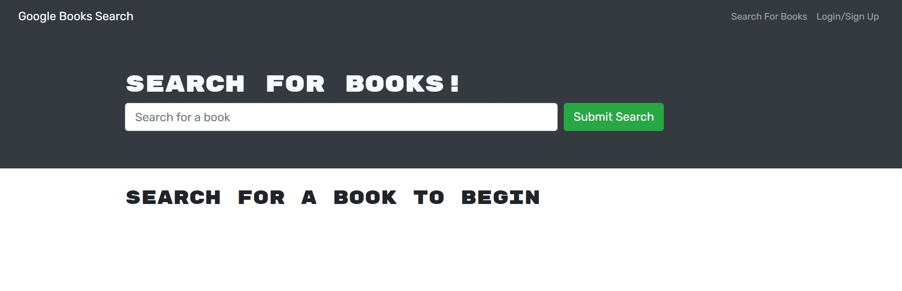
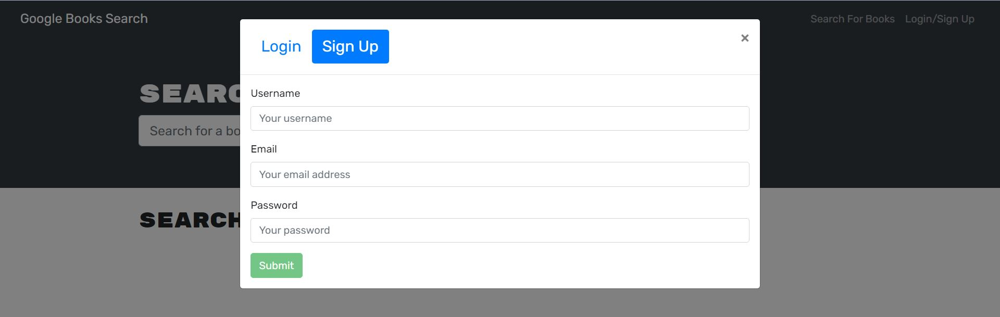
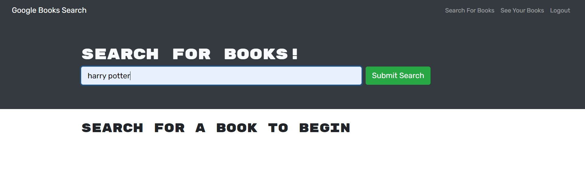
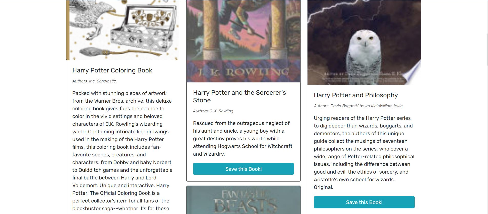
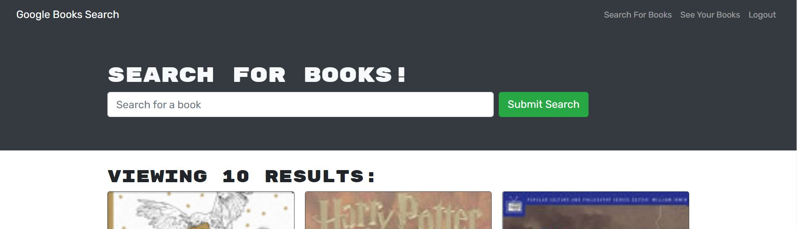
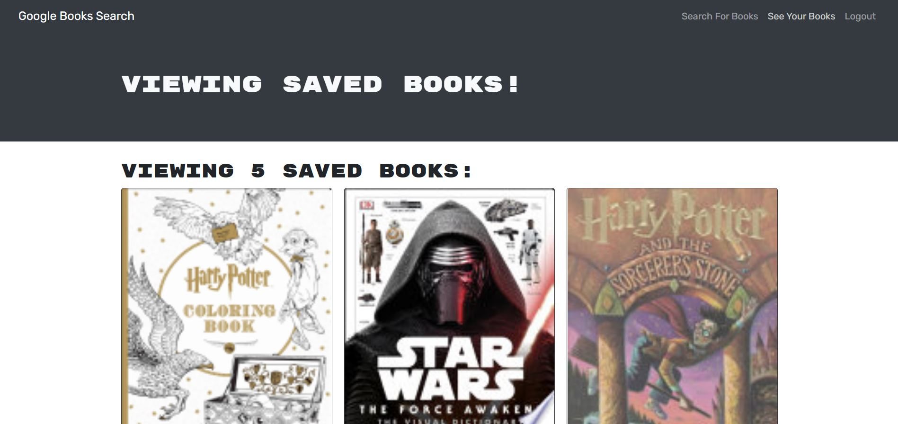
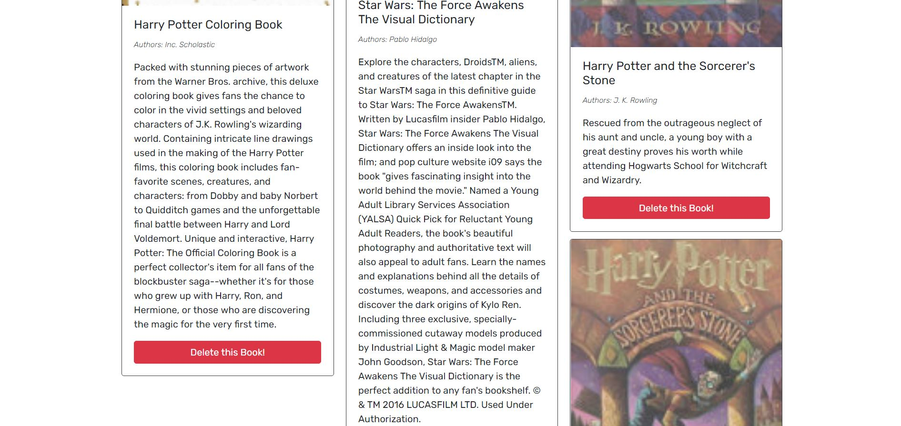

# Book Search Engine Starter Code

## Description
  Google books API search refactored to use GraphQL API built with Apollo Server. The app was built using the MERN stack, with a React front end and MongoDB database. End users are able to search for books, once signed in they are able to save books and see a list of their saved books. From this list of saved books they have the ability to delete a book from the list.

  ## Table of Contents
  [Installation](#Installation)  
  [Usage](#Usage)  
  [Contributing](#Contributing)   
  [Testing](#Testing)  
  [Questions](#Questions)  
  [License](#License) 
  
  ## Installation
  1. See Contributing for forking the repo
  2. Once these files are local on your machine
  3. Run 'npm install' in the terminal to create the necessary dependencies
  
  ## Usage
  ### on local machine
  1. Run 'npm run develop' to run the application
  2. The browser will automactically open to http://localhost:3000
  3. You have options to login, signup, search for books, save books, delete saved books and logout. See steps 2 thru 15 below "on Heroku" for more detail
  4. Once satisfied return to bash and disconnect by typing ctrl + c on your keyboard

  ### on Heroku
  1. Follow this link to the application: https://evening-plains-05402.herokuapp.com/
  2. In the upper right corner press Login/Sign up
  

  3. Press Sign Up
  4. Enter your username, email and password
  5. Press Submit
  

  6. Enter a title of a book you want to look up
  7. Press Submit Search
  

  8. Scroll down through the book options
  9. Press 'Save this book!' underneath the description of the book
  

  10. The text of the button now reads 'This book has already been saved'
  

  11. Continue adding books to your saved list
  12. To see your saved books list, go to top of the screen and press 'See Your Books'
  

  13. Scroll down to see saved books
  

  14. Press 'Delete this book' if you wish to remove a book from your list
  

  15. Lastly, you'll want to logout by pressing 'Logout' at the top of the page
  

 
  ## Contributing                                                                                                
  
  ### Add to Project  
  To work on or add to this project follow these steps  
  1. Fork the repository  
  2. Add you changes  
  3. Submit a pull request for approval  
  
  ### Issues
  To add issues in GitHub follow these steps
  1. Click on the issues tab
  2. Click 'New issue' button
  3. Give the issue a title and comments
  4. Click 'Submit new issue' button

  [Click here to view current GitHub Issues](https://github.com/kimberlyamaya/hit-me-with-your-book-search-engine/issues)   

  ## Testing

  ### Test Signup Logic
  1. After you signup you're logged in  
  2. Logout  
  3. Attemp to signup using the same email  
  4. You should get a message of 'Something went wrong with your signup'  

  ### Test Login Logic
  1. Attempt to enter the incorrect password while logging in  
  2. You should get a message of 'Something went wrong with your login credentials'  

  ### Test Save this book
  1. After searching for a book, press the 'Save this book' underneath the book's description  
  2. Go to 'See your books'  
  3. The book you saved should be listed  

  ### Test Delete this book
  1. Go to 'See your books'  
  2. Press 'Delete this book' underneath the book's description  
  3. The selected book should be removed from the page  

  ## Questions

  ### Contact
  For any questions please contact Kimberly Amaya 
  
  Email: [Link to Email](mailto:kimberly_kimbell@yahoo.com)  
  GitHub: [Link to GitHub Account](https://github.com/kimberlyamaya)  
  
  ## License
  This project contains a license from MIT 
  [Click here to see the license](license.md)
   